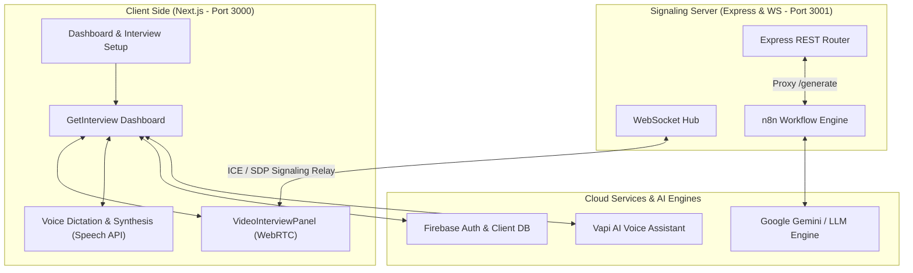

# 🤖 IntervueAI — Precision in Recruitment


## 🌟 Overview
**IntervueAI** is a premium, next-generation AI-powered mock interview platform designed to help students and professionals prepare for technical and behavioral interviews in a hyper-realistic environment. 

By eliminating static form-based templates, IntervueAI provides a **voice-first, natural interface** where candidates speak directly to Chloe, their virtual AI Recruiter. Built to replicate high-stakes corporate screening procedures, the platform generates personalized, resume-aligned questions, manages a secure live-stream peer panel using peer-to-peer WebRTC connections, and delivers comprehensive, structured evaluation reports in real-time.

---

## 🏗️ Architecture & Data Flow

Below is the conceptual architecture of how the frontend UI, custom signaling gateway, external AI APIs, and workflows integrate:



---

## ✨ Key Features

### 1. 📹 Interactive Video Assessment (WebRTC)
- **Live Peer Streams**: Real-time simulated peer-feed integration using a peer-to-peer WebRTC architecture.
- **Dynamic Control Hub**: Candidates can easily toggle camera (`Video`) and microphone (`Mic`) inputs directly within the feed container.
- **Resilient Signaling**: Custom Express-based WebSocket connection relaying Session Description Protocol (SDP) offers, answers, and ICE candidates dynamically.
- **Intelligent Error States**: Automatic server health checks and offline troubleshooting instructions in the client grid to guide developers.

### 2. 🗣️ Hands-Free Voice-First Interview Engine
- **Voice Dictation**: Uses continuous Web Speech Recognition (`webkitSpeechRecognition`) to let candidates naturally vocalize their responses.
- **Speech Synthesis**: Interactive Text-to-Speech (TTS) engine that reads questions out loud using natural, optimized English voice personas.
- **Interactive Recruiter Avatar**: Animated wave states and mic indicators that pulse synchronously with Chloe's speech and listening statuses.

### 3. 🤖 Resume-Tailored AI Generation
- **Targeted Questioning**: Creates customized, domain-specific interview sets based on user level (Junior, Mid, Senior), candidate tech stack, and interview types (Technical, Behavioral, HR).
- **LLM-Powered Orchestration**: Orchestrated by a powerful **n8n workflow pipeline** proxying backend queries to **Google Gemini**.

### 4. 📝 Real-Time Interactive Grading Reports
- **Detailed Evaluation Sheets**: Instant grading reports compiling scores, detailed strengths, and tailored growth metrics at the conclusion of each session.

### 5. 🔐 Robust Security & Auth
- **Firebase Core Auth**: Secure password/email authentication flow.
- **Firebase Admin SDK**: Safe database writing and administrative functions.

---

## 🛠️ Tech Stack

* **Frontend**: Next.js 16 (App Router), React 19, Tailwind CSS, Lucide Icons, Shadcn/UI, LiveKit Client.
* **Backend**: Node.js, Express, WebSocket (`ws`), TypeScript, `tsx`.
* **Database & Auth**: Firebase Auth, Firebase Admin SDK.
* **AI Pipelines**: Google Gemini (`@ai-sdk/google`), Vapi AI, n8n automation webhook.

---

## 🤸 Quick Start

Follow these steps to set up the project locally on your machine.

### 1. Clone & Install Dependencies

**Install Frontend Dependencies (Root Folder):**
```bash
npm install
```

**Install Backend Dependencies (Backend Folder):**
```bash
cd backend
npm install
cd ..
```

---

### 2. Set Up Environment Variables

#### Root Frontend `.env.local`
Create a `.env.local` file in the root directory and append the following credentials:
```env
NEXT_PUBLIC_VAPI_WEB_TOKEN=your_vapi_token
NEXT_PUBLIC_VAPI_WORKFLOW_ID=your_vapi_workflow_id

GOOGLE_GENERATIVE_AI_API_KEY=your_google_gemini_key

NEXT_PUBLIC_BASE_URL=http://localhost:3000
NEXT_PUBLIC_WS_URL=ws://localhost:3001

NEXT_PUBLIC_FIREBASE_API_KEY=your_firebase_key
NEXT_PUBLIC_FIREBASE_AUTH_DOMAIN=your_auth_domain
NEXT_PUBLIC_FIREBASE_PROJECT_ID=your_project_id
NEXT_PUBLIC_FIREBASE_STORAGE_BUCKET=your_bucket_id
NEXT_PUBLIC_FIREBASE_MESSAGING_SENDER_ID=your_sender_id
NEXT_PUBLIC_FIREBASE_APP_ID=your_app_id

FIREBASE_PROJECT_ID=your_firebase_project_id
FIREBASE_CLIENT_EMAIL=your_firebase_client_email
FIREBASE_PRIVATE_KEY=your_firebase_private_key
```

#### Backend `.env`
Create a `.env` file in the `/backend` directory:
```env
PORT=3001
N8N_WEBHOOK_URL=http://localhost:5678/webhook-test/generate-interview
```

---

### 3. Running the Project Locally

To run IntervueAI, you must spin up both the Next.js frontend client and the Express signaling server.

#### A. Start the Backend Server (Signaling Gateway)
```bash
cd backend
npm run dev
```
*The signaling gateway will spin up on `ws://localhost:3001`.*

#### B. Start the Frontend Client (Next.js Application)
Open a new terminal at the root directory and run:
```bash
npm run dev
```
*The client-side UI will start at [http://localhost:3000](http://localhost:3000).*

---

## 🤝 Contributions

Contributions are welcome! Please feel free to open a Pull Request or issue if you'd like to:
- 🎨 Enhance the Glassmorphism styling and UI micro-interactions.
- 🧠 Optimize WebRTC peer candidate negotiation speeds.
- 🚀 Integrate custom postures or speech analytics feedback.

---

## 📜 License
This project is licensed under the **MIT License**.

---

### **🎉 Happy Coding & Best of Luck for Your Interviews! 🚀**
